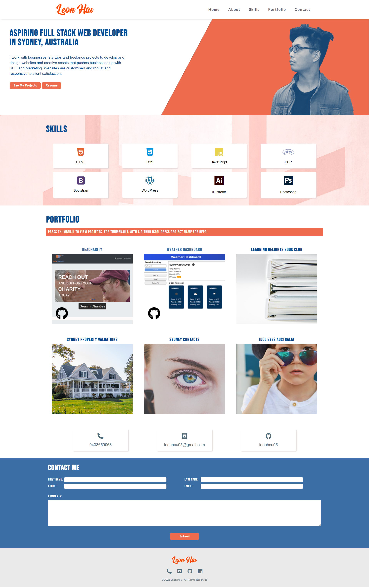

# Leon Hsu Portfolio

You can view my Portfolio here: [Leon Hsu Portfolio]()

## Table of Contents

- [Description](#description)
- [Usage](#usage)
- [Credits](#credits)
- [Copyright](#copyright)
- [Features](#features)
- [Improvements](#improvements)
- [Tests](#tests)

## Description

This is the portfolio of Leon Hsu[leonhsu95] that demonstrates his skills as a web developer over the course of his coding bootcamp training. 
It contains his information about himself, projects and contact details/form that you potential employers or network connections can reach him with.

## Technologies

Technologies used in this portfolio include:
 * HTML
 * CSS
 * JS/ES6 + Animation cdns
 * NodeJS and npms including:
    * bcrypt
    * connect-session-sequelize
    * dotenv
    * express
    * express-handlebars
    * express-session
    * handlebars
    * mysql2
    * nodemon
    * sequelize

 * Photoshop
 * Illustrator

## Usage

My portfolio should look like this, please do not recreate or reuse under any circumstances without permission:

 

## Credits

Project developed by Leon Hsu. Copyright 2021 Leon Hsu leonhsu95. All Rights Reserved.

## Copyright

Copyright (c) [2021] [leonhsu95]

This work may not be reprinted, reproduced or reused under any circumstances.

## Features

- The website is mobile first and responsive.
- Animation triggers on HTML elements on mouse scroll.
- Potential Employers can view all of my projects, skill proficiencies and contact details.

## Improvements
- The site can be more dynamic in animation and can take inspiration from awwwards.com websites.
- Contact Form can have js regex for validation and website can be hosted and turned into php to make Contact Form work.

## Tests

Website is validated with [HTML Markup Validation Tool](https://validator.w3.org/), [CSS Validation Service](https://jigsaw.w3.org/css-validator/) and [JS Validation Service](https://jshint.com/).
